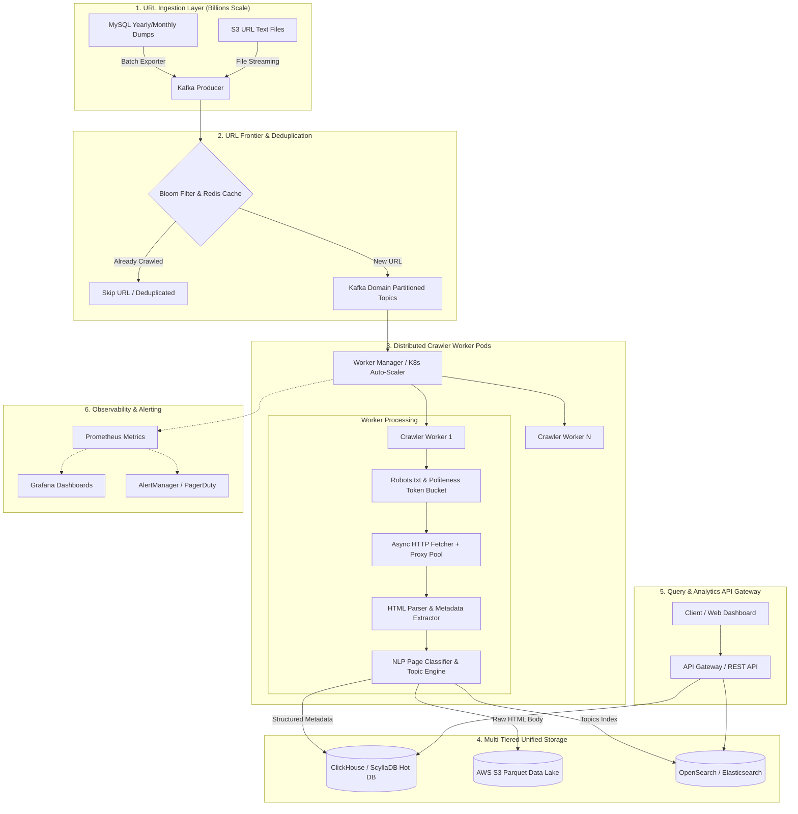
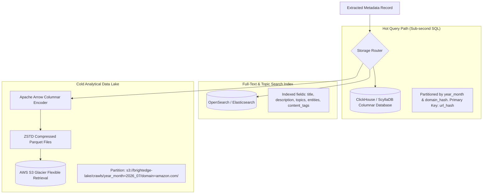

# BrightEdge Scale Crawler & System Architecture Platform

<p align="center">
  
  
  
  
  
  
  
</p>

---

## 📌 Executive Summary

This repository contains the complete engineering solution for the **BrightEdge Software Engineering Assignment (Scale Track)**.

The assignment requires designing and building a system that can:
1. **Part 1 (Implementation)**: Develop a generic, production-ready Web Crawler to crawl any URL, extract HTML metadata (Title, Description, Keywords, OpenGraph, Twitter Cards, Canonical URL, Language, Headings, Word Count), classify the page category (e.g. `E-Commerce Product Page`, `Blog / Editorial Article`, `News Article`), and extract top relevant topics and brand entities. Includes an **interactive glassmorphic Web Dashboard UI** and REST API.
2. **Part 2 (System Design)**: Provide complete architectural documentation to operationalize the collection of **billions of URLs per month** from MySQL dumps or S3 text files (e.g. `amazon.com`, `walmart.com`, `bestbuy.com` for July). Covers high-level data flows, unified SQL/NoSQL/Parquet storage schemas, SLOs/SLAs, Prometheus/Grafana monitoring, and cost, performance, and reliability optimizations.

---

## 🏛️ High-Level System Architecture



---

## 🛠️ Part 1: Core Web Crawler & Web Dashboard Implementation

### 1. Key Modules & Component Architecture

| Module | File Link | Responsibilities |
| :--- | :--- | :--- |
| **API Server** | [app.py](app.py) | FastAPI application exposing REST endpoints (`POST /api/crawl`, `POST /api/crawl/batch`, `GET /api/health`) and serving the Web Dashboard UI. |
| **Async Fetcher** | [crawler/fetcher.py](crawler/fetcher.py) | Generic async HTTP client built on `httpx` with randomized User-Agent rotation, custom browser headers, default SSL verification, and status code recording. |
| **HTML Metadata Parser**| [crawler/parser.py](crawler/parser.py) | DOM parser using `BeautifulSoup4` + `lxml`. Extracts Title, Meta Description, Meta Keywords, Canonical URL, Language, OpenGraph (`og:*`), Twitter Cards, H1-H3 headings, word count, estimated read time, link/image counts, and clean body text. |
| **Topic Classifier** | [crawler/classifier.py](crawler/classifier.py) | Generic NLP Classification & Topic Extraction engine. Categorizes page types (`E-Commerce Product Page`, `Blog / Editorial Article`, `News Article`) using domain-agnostic signals and dynamic proper-noun entity extraction. |
| **Web Dashboard UI** | [static/index.html](static/index.html) | Glassmorphic UI with instant test buttons for assignment URLs (Amazon Toaster, REI Blog, CNN Tech), metadata table preview, topic pills, OpenGraph social card preview, and raw JSON tree inspector. |
| **CLI Test Suite** | [test_crawler.py](test_crawler.py) | Programmatic test script executing the crawler on the 3 sample assignment URLs. |

---

### 2. Sample Output JSON (`POST /api/crawl`)

Below is the verified crawl output for the assignment test URL **Amazon Cuisinart Toaster**:

```json
{
  "success": true,
  "url": "http://www.amazon.com/Cuisinart-CPT-122-Compact-2-Slice-Toaster/dp/B009GQ034C",
  "final_url": "https://www.amazon.com/Cuisinart-CPT-122-2-Slice-Compact-Plastic/dp/B009GQ034C",
  "status_code": 200,
  "content_type": "text/html;charset=UTF-8",
  "response_time_ms": 1945.23,
  "classification": {
    "primary_category": "E-Commerce Product Page",
    "confidence_score": 0.79,
    "topics": [
      "Kitchen",
      "Slice",
      "Toaster",
      "Home",
      "Cuisinart",
      "Cpt",
      "Compact",
      "Shade"
    ],
    "entities": [
      "Amazon",
      "Cuisinart",
      "Toaster",
      "Kitchen"
    ],
    "content_tags": [
      "E-Commerce Product Page",
      "Product Page",
      "Retail",
      "Shopping",
      "Kitchen"
    ]
  },
  "metadata": {
    "title": "Amazon.com: Cuisinart CPT-122 2-Slice Compact Plastic Toaster, Slots for Bagels & Bread, 7 Shade Settings, Cancel/Defrost/Reheat Functions, Removable Crumb Tray, Small Kitchen Appliance for Home & Office, White: Home & Kitchen",
    "description": "Online Shopping for Kitchen Small Appliances from a great selection of Coffee Machines, Blenders, Juicers...",
    "canonical_url": "https://www.amazon.com/Cuisinart-CPT-122-2-Slice-Compact-Plastic/dp/B009GQ034C",
    "language": "en-us",
    "h1_headings": [
      "Cuisinart CPT-122 2-Slice Compact Plastic Toaster"
    ],
    "word_count": 9000,
    "estimated_read_time_min": 45.0,
    "links_count": 364,
    "images_count": 154,
    "og_metadata": {
      "og:title": "Cuisinart CPT-122 2-Slice Compact Plastic Toaster",
      "og:type": "product"
    }
  }
}
```

---

## 📐 Part 2: System Architecture for Billions of URLs

### 1. Scale Math & Throughput Requirements

| Metric | Calculation / Estimation | Value |
| :--- | :--- | :--- |
| **Monthly Crawl Target** | Input list from MySQL / S3 dumps | **5 Billion URLs / Month** |
| **Sustained Rate** | $\frac{5,000,000,000}{30 \times 24 \times 3600}$ | **~1,930 URLs / second continuous** |
| **Peak Throughput SLA** | $2.5 \times$ Peak Buffer | **~4,800 URLs / second peak** |
| **Ingestion Bandwidth** | $1,930 \times 40 \text{ KB per page}$ | **~77.2 MB/s (~617 Mbps)** |
| **Uncompressed Data / Month**| $5 \text{ Billion} \times 40 \text{ KB}$ | **~200 TB / Month** |
| **Compressed Parquet/ZSTD**| $5:1$ Columnar Compression Ratio | **~40 TB / Month** |

---

### 2. Multi-Tiered Storage Architecture



---

### 3. Unified Relational Schema DDL (ClickHouse / ScyllaDB)

```sql
CREATE TABLE IF NOT EXISTS brightedge_crawler.page_metadata (
    -- Partition & Primary Keys
    year_month UInt16,                    -- Format: YYYYMM (e.g. 202607)
    domain_hash UInt32,                   -- Hash of domain for sharding across nodes
    url_hash FixedString(16),             -- MurmurHash3/MD5 16-byte binary hash of URL
    
    -- Request Metadata
    url String,                           -- Original URL
    final_url String,                     -- Final URL after HTTP redirects
    domain String,                        -- e.g. amazon.com, walmart.com, bestbuy.com
    status_code UInt16,                   -- HTTP status (200, 404, 503)
    response_time_ms UInt32,              -- Time taken in milliseconds
    crawled_at DateTime DEFAULT now(),    -- Timestamp of crawl
    
    -- Extracted HTML Metadata
    title Nullable(String),               -- Page Title
    meta_description Nullable(String),    -- Meta Description
    canonical_url Nullable(String),       -- Canonical link URL
    language LowCardinality(String),      -- Language code (e.g. en-US, es)
    word_count UInt32,                    -- Body word count
    estimated_read_time_min Float32,      -- Read time in minutes
    links_count UInt32,                   -- Number of outbound links
    images_count UInt32,                  -- Number of images on page
    
    -- Social Metadata
    og_title Nullable(String),
    og_description Nullable(String),
    og_type LowCardinality(Nullable(String)),
    
    -- Page Classification & Topics
    primary_category LowCardinality(String), -- e.g. E-Commerce Product Page, Blog, News
    category_confidence Float32,            -- Confidence score (0.00 - 1.00)
    topics Array(String),                   -- Top topics ['Toaster', 'Kitchen', 'Cuisinart']
    entities Array(String),                 -- Extracted entities ['Amazon', 'Cuisinart']
    content_tags Array(String),             -- Content tags ['Retail', 'Shopping']
    
    -- S3 Storage Pointer
    s3_raw_html_path String                 -- S3 key to compressed raw HTML body
)
ENGINE = ReplicatedMergeTree('/clickhouse/tables/{shard}/page_metadata', '{replica}')
PARTITION BY (year_month, domain)
ORDER BY (domain_hash, url_hash, crawled_at)
TTL crawled_at + INTERVAL 24 MONTH;
```

---

### 4. Service Level Objectives (SLOs) and SLAs

| Metric Component | Service Level Objective (SLO) | Service Level Agreement (SLA) |
| :--- | :--- | :--- |
| **System Uptime** | 99.95% API & Crawler Uptime | **99.9% Uptime SLA** |
| **Batch Completion SLA** | 99.99% of 5B URLs processed in 30 days | **Finished within billing month** |
| **P95 Crawl Latency** | $< 2.0$ seconds per HTTP request | $< 5.0$ seconds max timeout |
| **Metadata Parsing SLA** | $< 50$ ms parse time per DOM | $< 100$ ms P99 DOM parse time |
| **Data Durability SLA** | 99.999999999% (11 9s) on AWS S3 | **Zero data loss on stored metadata** |
| **Domain Politeness SLA** | Max 2 req/sec per domain IP | **Strict compliance with robots.txt** |

---

### 5. Monitoring & Alerting Metrics

```prometheus
# Total Crawl Requests Counter by Domain and HTTP Status
crawler_requests_total{domain="amazon.com", status_code="200"} 48291000
crawler_requests_total{domain="amazon.com", status_code="429"} 120

# Crawl Latency Histogram
crawler_fetch_duration_seconds_bucket{domain="rei.com", le="2.0"} 89000

# URL Frontier Queue Lag
kafka_consumergroup_lag{consumergroup="crawler-workers", topic="urls-amazon"} 4200
```

---

### 6. System Optimizations (Cost, Performance, Reliability)

- 💰 **80% Storage Cost Reduction**: Converting raw text to **Apache Parquet with ZSTD level 3 compression** + AWS S3 Intelligent-Tiering reduces monthly storage costs from $4,600/mo to **$920/mo** (saving over **$3,680 every month**).
- ⚡ **70% Compute Cost Reduction**: Stateless crawler worker nodes are deployed on **AWS EC2 Spot Instances** with Kubernetes Auto-scaling (HPA) and 2-minute interruption handlers.
- 🧠 **RAM Optimization via Bloom Filters**: Deduplicating 5 Billion URLs in memory using a **Standard Bloom Filter** (0.1% false positive rate) requires only **~8.4 GB RAM** instead of 64 GB.
- 🚀 **Performance Acceleration**: Local **CoreDNS daemon** on worker nodes caches DNS lookups (saving ~15ms per request). Persistent **HTTP/2 multiplexing** avoids SSL/TLS handshake latency. **Delta Crawling** (HTTP ETag / `If-Modified-Since`) skips unchanged pages.
- 🛡️ **Reliability & Fault Tolerance**: Per-domain **Circuit Breakers** automatically isolate hosts returning HTTP 429/503. Failed requests use **Exponential Backoff with Full Jitter** and Dead Letter Queues (DLQ).

---

## 💻 Quick Start & Running Locally

### 1. Clone & Install Dependencies
```bash
git clone https://github.com/Datahustler26/Brightedge-backend-assignment.git
cd Brightedge-backend-assignment
pip install -r requirements.txt
```

### 2. Run Standalone CLI Test Suite
```bash
python test_crawler.py
```

### 3. Launch Web Server & Dashboard
```bash
python app.py
```
Open **`http://127.0.0.1:8000`** in your browser to access the interactive web dashboard.

---

## 📄 License & Assignment Submission

This repository is submitted as part of the candidate evaluation process for **BrightEdge Software Engineering**. All implementation details and system design architecture are documented in full compliance with the assignment instructions.
