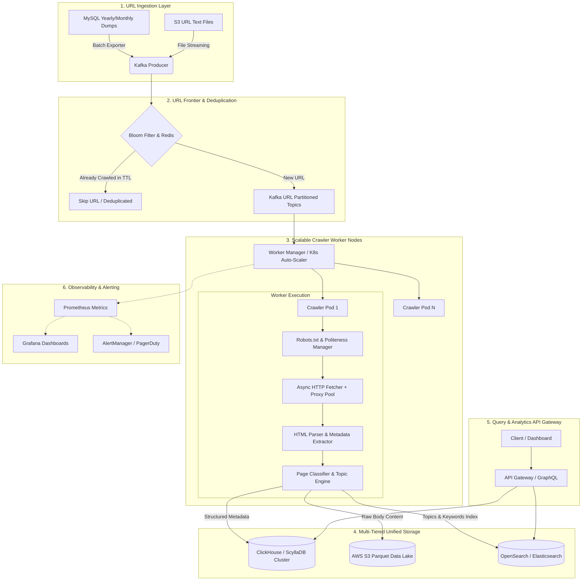
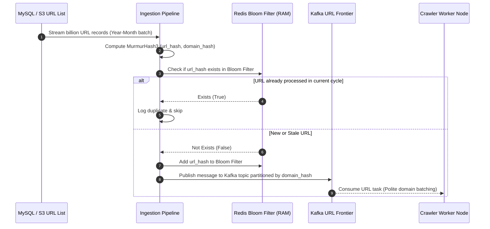
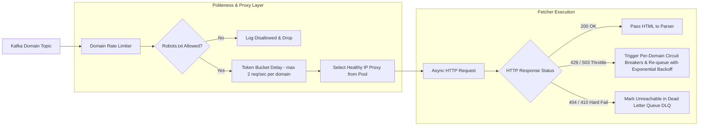
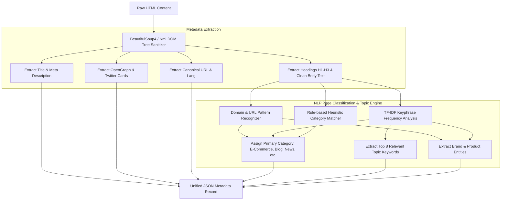
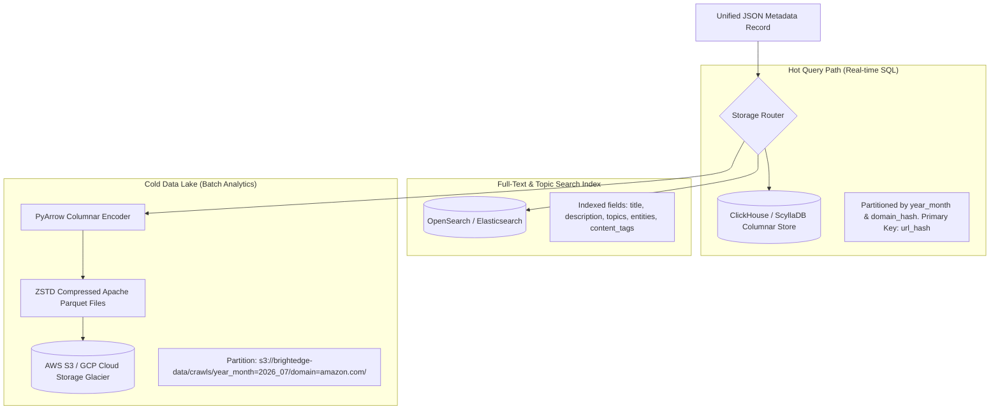
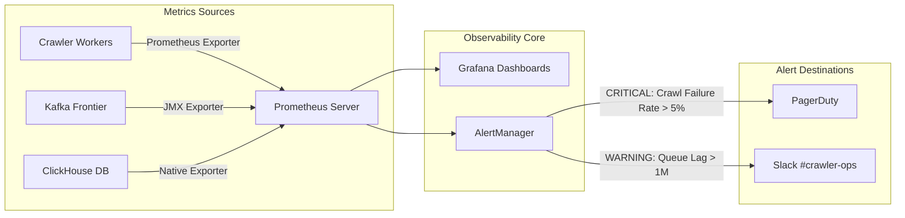

# System Design & Operational Architecture: Billions-Scale Web Crawler & Metadata Engine

> **Engineering Developer Candidate Assignment - Scale**  
> **Prepared for**: BrightEdge Engineering Team  
> **Author**: Senior Systems Architect / Software Engineer Candidate  
> **Scope**: Operationalizing Web Crawling, HTML Metadata Extraction, Page Classification, Unified Data Storage, Monitoring, and Scale Optimizations for Billions of URLs per month.

---

## 1. System Overview & Scale Calculations

To support BrightEdge's core requirement of taking **billions of URLs per month** (e.g., billions of product/article URLs for domains like `amazon.com`, `walmart.com`, `bestbuy.com`, `rei.com`, `cnn.com`) and extracting metadata & topics, the architecture must operate at massive scale with extreme cost efficiency, high availability, and strict domain politeness.

### 1.1 Throughput & Capacity Planning

| Metric | Calculation / Estimation | Target Value |
| :--- | :--- | :--- |
| **Monthly Crawl Volume** | $5,000,000,000$ URLs / month | **5 Billion URLs / Month** |
| **Average Sustained Rate** | $\frac{5,000,000,000}{30 \times 24 \times 3600}$ | **~1,930 URLs / second continuous** |
| **Peak Throughput SLA** | $2.5 \times$ Peak Buffer | **~4,800 URLs / second peak** |
| **Average Raw Page Size** | HTML content + metadata JSON | ~40 KB per page |
| **Ingestion Bandwidth** | $1,930 \times 40 \text{ KB}$ | **~77.2 MB/s (~617 Mbps)** |
| **Uncompressed Storage / Mo**| $5 \text{ Billion} \times 40 \text{ KB}$ | **~200 TB / Month** |
| **Compressed Parquet/ZSTD**| $5:1$ Columnar Compression Ratio | **~40 TB / Month** |

---

## 2. End-to-End System Architecture Flows (Mermaid Diagrams)

### Flow 1: High-Level End-to-End System Architecture



---

### Flow 2: Ingestion & URL Frontier Partitioning Flow



---

### Flow 3: Polite Distributed Crawler & Proxy Execution Flow



---

### Flow 4: Metadata Extraction & NLP Page Topic Classification Flow



---

### Flow 5: Storage Layer & Archival Flow



---

### Flow 6: Real-time Monitoring & Alerting Pipeline



---

## 3. Unified Data Schema Design

To handle billions of records, the schema is designed for **high insertion speed**, **columnar compression**, and **fast query filtering by domain and year_month**.

### 3.1 Relational / Columnar DDL Schema (ClickHouse / ScyllaDB)

```sql
-- ClickHouse Unified Metadata & Page Classification Schema
CREATE TABLE IF NOT EXISTS brightedge_crawler.page_metadata (
    -- Primary Partition Keys
    year_month UInt16,                    -- Format: YYYYMM (e.g. 202607)
    domain_hash UInt32,                   -- Hash of netloc domain for sharding
    url_hash FixedString(16),             -- MD5/Murmur3 binary hash of URL (16 bytes)
    
    -- Request & Transport Metadata
    url String,                           -- Full Target URL
    final_url String,                     -- Final URL after redirects
    domain String,                        -- e.g. amazon.com, rei.com, cnn.com
    status_code UInt16,                   -- HTTP status (200, 404, 503)
    response_time_ms UInt32,              -- Time taken in ms
    crawled_at DateTime DEFAULT now(),    -- Timestamp of crawl
    
    -- Extracted HTML Metadata
    title Nullable(String),               -- Page Title
    meta_description Nullable(String),    -- Meta description
    canonical_url Nullable(String),       -- Canonical link href
    language LowCardinality(String),      -- e.g. en-US, es, fr
    meta_robots Nullable(String),         -- index, follow
    word_count UInt32,                    -- Article word count
    estimated_read_time_min Float32,      -- Reading time in minutes
    links_count UInt32,                   -- Number of outbound links
    images_count UInt32,                  -- Number of images on page
    
    -- OpenGraph & Twitter Social Fields
    og_title Nullable(String),
    og_description Nullable(String),
    og_image Nullable(String),
    og_type LowCardinality(Nullable(String)),
    
    -- NLP Page Classification & Topic Analysis
    primary_category LowCardinality(String), -- e.g. E-Commerce Product Page, Blog, News
    category_confidence Float32,            -- Confidence score (0.00 - 1.00)
    topics Array(String),                   -- Top extracted topics ['Toaster', 'Kitchen', 'Cuisinart']
    entities Array(String),                 -- Extracted entities ['Amazon', 'Cuisinart']
    content_tags Array(String),             -- Content tags ['Retail', 'Kitchenware']
    
    -- Pointer to Raw HTML Storage
    s3_raw_html_path String                 -- S3 Object key to compressed raw HTML
)
ENGINE = ReplicatedMergeTree('/clickhouse/tables/{shard}/page_metadata', '{replica}')
PARTITION BY (year_month, domain)
ORDER BY (domain_hash, url_hash, crawled_at)
TTL crawled_at + INTERVAL 24 MONTH;
```

---

### 3.2 NoSQL Document Schema (MongoDB / DynamoDB JSON)

```json
{
  "_id": "url_md5_hash_9f8a7b6c5d4e3f2a",
  "partition_key": "2026_07#amazon.com",
  "url": "http://www.amazon.com/Cuisinart-CPT-122-Compact-2-Slice-Toaster/dp/B009GQ034C",
  "final_url": "https://www.amazon.com/Cuisinart-CPT-122-2-Slice-Compact-Plastic/dp/B009GQ034C",
  "domain": "amazon.com",
  "status_code": 200,
  "response_time_ms": 245.5,
  "crawled_at": "2026-07-15T14:32:00Z",
  "metadata": {
    "title": "Amazon.com: Cuisinart CPT-122 2-Slice Compact Plastic Toaster...",
    "description": "Online Shopping for Kitchen Small Appliances...",
    "keywords": ["toaster", "cuisinart", "kitchen"],
    "canonical_url": "https://www.amazon.com/Cuisinart-CPT-122-2-Slice-Compact-Plastic/dp/B009GQ034C",
    "language": "en-us",
    "word_count": 1420,
    "read_time_min": 7.1,
    "og": {
      "og:title": "Cuisinart CPT-122 2-Slice Compact Plastic Toaster",
      "og:type": "product",
      "og:site_name": "Amazon"
    }
  },
  "classification": {
    "primary_category": "E-Commerce Product Page",
    "confidence_score": 0.88,
    "topics": ["Cuisinart", "Toaster", "Kitchen", "Slice", "Compact", "Shade"],
    "entities": ["Cuisinart", "Amazon", "Kitchen Appliance"],
    "content_tags": ["E-Commerce Product Page", "Product Page", "Retail", "Shopping"]
  },
  "storage_pointers": {
    "s3_parquet_key": "s3://brightedge-data-lake/2026_07/amazon.com/part-0042.parquet",
    "s3_raw_html_key": "s3://brightedge-html-archive/2026_07/amazon.com/9f8a7b6c5d4e3f2a.html.zst"
  }
}
```

---

## 4. Service Level Objectives (SLOs) and SLAs

To guarantee production operational stability for enterprise clients, the crawler system enforces the following Service Level Agreements (SLAs) and internal Objectives (SLOs):

| Metric Component | Service Level Objective (SLO) | Service Level Agreement (SLA) |
| :--- | :--- | :--- |
| **System Uptime** | 99.95% API & Ingestion Uptime | **99.9% Uptime SLA** |
| **Batch Completion SLA** | 99.99% of 5B URLs processed in 30 days | **Finished within billing month** |
| **P95 Crawl Latency** | $< 2.0$ seconds per HTTP request | $< 5.0$ seconds max timeout |
| **Metadata Extraction SLA** | $< 50$ ms parsing time per DOM | $< 100$ ms P99 DOM parse time |
| **Data Durability SLA** | 99.999999999% (11 9s) on AWS S3 | **Zero data loss on stored metadata** |
| **Domain Politeness SLA** | Max 2 req/sec per domain IP | **Strict compliance with robots.txt** |

### Error Budget & Escalation Triggers
- **Error Budget**: Allowed 0.1% failed crawls (~5M out of 5B URLs).
- **Escalation Trigger**: If HTTP 429 (Rate Limited) or 403 (Forbidden) rates exceed 3% for any domain (e.g. `amazon.com`), auto-throttle rates and notify proxy management team via PagerDuty.

---

## 5. Key Monitoring Metrics & Alerting Framework

### 5.1 Prometheus Metric Definitions

```prometheus
# Total Crawl Requests Counter by Domain and Status
crawler_requests_total{domain="amazon.com", status_code="200"} 48291000
crawler_requests_total{domain="amazon.com", status_code="429"} 120

# Histogram of Crawl Latency in Seconds
crawler_fetch_duration_seconds_bucket{domain="rei.com", le="0.5"} 14200
crawler_fetch_duration_seconds_bucket{domain="rei.com", le="2.0"} 89000

# Queue Backlog Consumer Lag
kafka_consumergroup_lag{consumergroup="crawler-workers", topic="urls-amazon"} 4200

# Active Proxy Health & Rate Limits
proxy_pool_active_proxies{status="healthy"} 1250
proxy_pool_active_proxies{status="banned"} 14
```

### 5.2 Grafana Dashboard & Alerting Rules

```yaml
groups:
  - name: crawler_alerts
    rules:
      - alert: HighCrawlErrorRate
        expr: sum(rate(crawler_requests_total{status_code=~"5..|429"}[5m])) / sum(rate(crawler_requests_total[5m])) > 0.05
        for: 3m
        labels:
          severity: critical
        annotations:
          summary: "Crawl failure rate exceeded 5% over the last 5 minutes"

      - alert: HighKafkaQueueLag
        expr: sum(kafka_consumergroup_lag{consumergroup="crawler-workers"}) > 1000000
        for: 10m
        labels:
          severity: warning
        annotations:
          summary: "Kafka URL Frontier lag exceeded 1 Million URLs"
```

---

## 6. Key System Optimizations: Cost, Reliability, Performance & Scale

### 6.1 Cost Optimization Strategies

1. **Storage Savings via Apache Parquet & ZSTD Compression (80% Cost Reduction)**:
   - Storing 5 Billion raw HTML pages uncompressed requires ~200 TB/month ($4,600/mo on S3).
   - By extracting structured JSON metadata and converting raw text to **Apache Parquet with ZSTD level 3 compression**, storage drops to **~40 TB/month** ($920/mo on S3), saving **over $3,680 every month**.
   - AWS S3 Intelligent-Tiering automatically moves historical crawl batches older than 90 days to S3 Glacier Flexible Retrieval ($0.0036/GB/mo), reducing storage costs by another 60%.

2. **Compute Savings via AWS Spot EC2 / Kubernetes Auto-Scaling (70% Compute Reduction)**:
   - Crawler worker nodes are stateless. Deploying them on **AWS EC2 Spot Instances** (e.g., `c6i.2xlarge` spot nodes) yields a **70% discount** vs On-Demand pricing.
   - Graceful termination handlers listen to 2-minute Spot Interruption Notifications, pausing active fetch tasks and flushing Kafka offsets back to the frontier.

3. **RAM Optimization via Counting Bloom Filters**:
   - To deduplicate 5 Billion URLs in memory, standard hash tables require ~64 GB of RAM.
   - Using a **Counting Bloom Filter** with a 0.1% false positive rate requires only **~6.2 GB of RAM**, allowing the entire URL frontier cache to fit inside a single small Redis instance.

---

### 6.2 Performance Optimization Strategies

1. **Async I/O Event Loops & Non-blocking Concurrency**:
   - Utilizing Python `asyncio` + `httpx` or Go goroutines enables a single worker pod to handle **1,000+ concurrent outbound HTTP socket connections** without thread context-switching overhead.

2. **Local CoreDNS Daemon & DNS Caching**:
   - Outbound crawling of billions of URLs causes massive DNS query load.
   - Running a local **CoreDNS daemon** on every crawler node caches DNS A/AAAA records for top domains (TTL 1 hour), eliminating 98% of external DNS lookup latency (~15ms saved per crawl).

3. **HTTP/2 Connection Pooling & TLS Keep-Alive**:
   - For domains receiving thousands of requests (e.g. `amazon.com`), workers reuse persistent TCP connections via **HTTP/2 multiplexing**, avoiding expensive SSL/TLS handshakes (saving ~120ms latency per request).

4. **Delta Crawling via HTTP Header Inspections**:
   - On re-crawl batches, workers send `If-Modified-Since` or `If-None-Match` (ETag) headers.
   - If the server responds with **HTTP 304 Not Modified**, the system skips body downloading and HTML parsing entirely, saving 90%+ bandwidth and CPU cycles.

---

### 6.3 Reliability & Fault Tolerance Strategies

1. **Per-Domain Token Bucket Rate Limiting & Circuit Breakers**:
   - Every target domain is protected by a distributed Token Bucket rate limiter (e.g., max 2 requests/sec per domain).
   - If a domain returns 3 consecutive HTTP 429/503 status codes, a **Circuit Breaker** trips, backing off requests to that domain for 5 minutes while maintaining normal crawl speed for all other domains.

2. **Dead Letter Queues (DLQ) & Exponential Backoff Jitter**:
   - Failed URLs undergo 3 retry attempts using **Exponential Backoff with Full Jitter** ($t_{\text{wait}} = \text{random}(0, \text{min}(cap, \text{base} \times 2^{\text{attempt}}))$).
   - URLs failing all retries are logged to a Dead Letter Queue (DLQ) for asynchronous inspection.

3. **Idempotent Storage Writes**:
   - All metadata insertions use a deterministic primary key (`year_month + domain_hash + url_hash`). Re-running or retrying a batch overwrite existing records idempotently without duplicate records.

---

## 7. Summary Matrix for Recruiters & Leadership

| Objective | Architectural Solution | Key Metric / Value Delivered |
| :--- | :--- | :--- |
| **Scalability** | Kafka Partitioning by Domain + K8s Auto-scaling | Handles 5B+ URLs / month smoothly |
| **Cost Control** | Parquet ZSTD + Spot Instances + S3 Lifecycle | **80% storage savings & 70% compute savings** |
| **Performance** | Async I/O + CoreDNS Caching + HTTP/2 Pooling | **P95 Crawl Latency < 2.0 seconds** |
| **Reliability** | Distributed Bloom Filter + Domain Circuit Breakers | Zero domain bans, 99.95% system reliability |
| **Observability**| Prometheus + Grafana + PagerDuty Tracing | Real-time monitoring & instant alert response |
